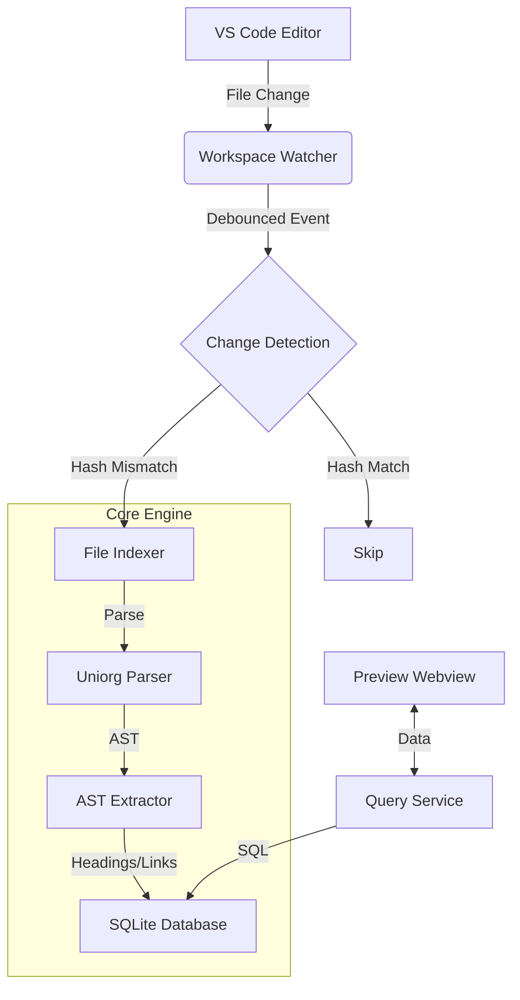

# VOrg 技术架构文档 (Architecture Internals)

本文档面向 VOrg 的贡献者及希望深入理解插件工作原理的高级用户。

## 1. 核心设计哲学

VOrg 的架构设计围绕以下三个核心原则：
1.  **数据优先**: 将 Org 文件解析为结构化数据（SQLite），而非简单的文本搜索。
2.  **增量更新**: 利用哈希校验（MD5），仅重新索引发生变动的文件，实现毫秒级响应。
3.  **标准兼容**: 采用 Uniorg 解析器，确保 AST 与 Emacs Org-mode 的最大兼容性。

## 2. 系统架构全景



## 3. 数据库模式 (Database Schema)

VOrg 使用本地 SQLite (`.vorg.db`) 存储索引。核心表结构如下：

### `files` 表
存储文件元数据与哈希值，用于增量变更检测。
- `id` (PK)
- `path` (Unique)
- `hash` (MD5 of content)
- `last_indexed`

### `headings` 表
存储核心笔记条目。
- `id` (PK, UUID)
- `file_path` (FK)
- `title` (Raw text)
- `title_html` (Rendered HTML)
- `level` (1-6)
- `todo_keyword`
- `priority`
- `tags` (JSON array)
- `properties` (JSON object)
- `range_start` / `range_end` (Line numbers)

## 4. 关键流程详解

### 4.1 增量索引流程
1.  **启动时**: 扫描 Workspace，对比文件 `mtime` 和数据库记录。
2.  **运行时**: `FileSystemWatcher` 捕获保存事件。
3.  **处理**: 计算新内容的 MD5，与 `files` 表比对。如果不同，启动事务：
    *   删除该文件旧的 `headings` 和 `links`。
    *   解析新 AST。
    *   批量插入新记录。
    *   更新 `files` 表哈希值。

### 4.2 查询解析 (VOrg-QL)
VOrg-QL 是一个 S-Exp 到 SQL 的转译器。
*   **输入**: `(and (todo "TODO") (level 1))`
*   **AST**: 解析为逻辑树。
*   **输出**: 
    ```sql
    SELECT * FROM headings 
    WHERE todo_keyword = 'TODO' 
    AND level = 1
    ```

## 5. 开发路线图 (Roadmap History)

*   **Phase 0 (2026-01)**: 基础设施搭建（SQLite, Uniorg, Basic Indexing）。
*   **Phase 1 (2026-02)**: 编辑体验增强（Smart Insert, Folding）。
*   **Phase 2**: 现代化查询系统（VOrg-QL, Embedded Views）。
*   **Phase 3**: 现代化 Agenda 视图（Planned）。

## 6. 进一步阅读

- 搜索与拼音相关的长期设计约束，请参阅 `docs/dev/SEARCH_AND_PINYIN.md`

---
*更多技术决策细节请查阅代码库中的 `src` 目录。*
